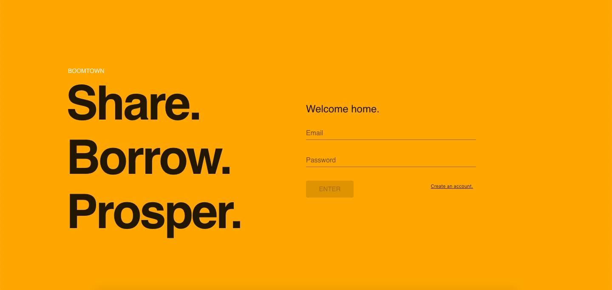

# Boomtown 🏙

### ScreenShot



---

## Description

This project displays my abilities to run server side queries (graphQL) and connect to the client using apollo. The project uses Redux to update states and I use react compnents to make the user flow. Final form is also used for user login and validation. Learned how to use tokens to transfer information safely.

---

## Server Instruction

Commands must be run from the `server` directory:

### Installation

Install the npm node modules like:

```bash
npm install
```

## Usage

### Run this:

```bash
npm run start:dev
```

### Technologies Used

- Node
- Express
- Apollo
- Postgres
- GraphQL

---

## Client Insruction

Commands must be run from the `client` directory:

### Installation

Install the npm node modules like:

```bash
npm install
```

## Usage

- Run this:

```bash
npm start
```

### Build

```bash
npm run build
```

## Technologies Used

- React
- Redux
- Material-UI
- Apollo
- React Router

---

## Author

- Name: Jeremiah
- My [Linkin](https://www.linkedin.com/in/jeremiah-aguirre-606708181/)

## Am I missing some essential feature?

- **Nothing is impossible!**

- Open an [issue](https://github.com/jeremiahaguirre/boomtown/issues/new) and let's make Boomtown better together!

- _Bug reports, feature requests, patches, and well-wishes are always welcome._ :heavy_exclamation_mark:
